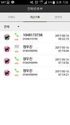
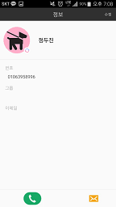

# Android AddressBook

## Preview Screen

### Logo

컨셉을 귀여운 강아지 전화번호부로 설정해서 시작시 3초간 로고를 보여주고 시작합니다. 과제용으로 한 것이라 이미지 저작권에 대한 권한은 따로 받지 않았습니다.

### Keypad

숫자를 입력해서 번호를 만들 수 있고 #을 누르면 번호를 초기화합니다

아래 버튼에서 전화와 문자 버튼을 누르면 써두었던 번호로 연락이 가고 (번호가 없을때 제외)

지움 버튼을 누르면 한글자씩 지워집니다.

숫자 view가 refresh 될 때마다 연락처에 있는 사람을 찾고 있으면 위에 바에 표출합니다.

찾은 연락처를 누르면 입력한 번호가 찾은 사람 번호로 치환됩니다.

사람이 없을 시에는 위에 바에 + 연락처에 추가 버튼이 나와서 사람 추가 화면으로 intent 합니다

### Log

전화, SMS 를 받거나 보낸 기록을 보여줍니다. 따로 넣지 않는 이상 받는 기능은 없기 때문에 소스에서 넣어주지 않으면 send 한 것 밖에 보이지 않을 것입니다.

전화나 SMS를 보낼 수 있는 곳은 Keypad나 Info 화면에서 할 수 있습니다

위에 바의 스피너를 바꾸는 것으로 전체보기, 전화목록보기, SMS목록 보기를 할 수 있습니다.

내 연락처에 등록 되어 있는 사람은 번호를 이름으로 치환하고 등록이 안되어 있는 사람은 아이콘이 회색으로 나옵니다.

### Address

전화번호부에 저장되어 있는 사람 목록을 볼 수 있습니다.

기능에는 검색, 추가 삭제가 있습니다.

삭제를 누를 시 옆에 체크박스가 플로팅 되면서 체크한 사람을 삭제 할 수 있습니다.

리스트를 롱클릭 할시 삭제 기능을 활성화 시킵니다

### Info

전화번호부에 저장되어 있는 사람을 짧게 클릭 시 그사람의 정보 화면으로 intent합니다

정보 화면에는 이름, 번호, 그룹 이메일을 표출하며, 위의 수정 버튼을 누르면 수정 화면으로 갑니다.

### Add Modify

Add와 Modify는 같은 화면을 가지고 있지만 Add는 단지 더하고 Modify는 원래 있던 데이터를 수정합니다

이름과 번호는 공백으로 저장 할 수 없습니다.

화면의 아이콘을 클릭 하는 것으로 분홍색, 파란색을 바꿀 수 있습니다.

